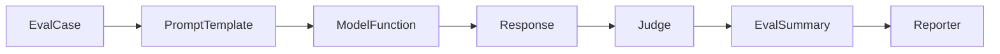

# prompt-eval

Prompt regression testing for CI, runnable without API keys.

**Thesis:** prompts deserve unit tests. A prompt change should produce a small,
reviewable report: inputs, rendered prompt, response, judge score, failures, and
latency.

## Run It In 30 Seconds

```bash
python -m pip install -e ".[dev]" && python examples/no_api_key_regression.py
```

The demo uses a deterministic local model function, so it can run in CI without
secrets.

## Why Care?

- You want to know whether prompt version B actually regressed behavior.
- You need no-key tests for prompt templates and scoring logic.
- You want judges that are plain Python objects, not hidden service calls.

## Architecture



## Example

```python
from prompt_eval import Contains, EvalCase, EvalRunner, PromptTemplate

template = PromptTemplate("Classify: {{ ticket }}")
llm = lambda prompt: "category: billing"
cases = [EvalCase({"ticket": "refund please"}, "billing")]
summary = EvalRunner(template, Contains(ignore_case=True), llm).run(cases)
assert summary.pass_rate == 1.0
```

## Built-In Judges

Exact match, contains, fuzzy match, regex match, semantic similarity, LLM judge,
and weighted composite judges.

## Limitations

- Local string judges are not substitutes for domain review.
- LLM-as-judge is supported but should be calibrated and versioned.
- This project tests prompt behavior; it does not manage datasets or model
  deployment.

## Development

```bash
python -m pip install -e ".[dev]"
pytest
python scripts/ci_regression_demo.py
```

See [ARCHITECTURE.md](docs/ARCHITECTURE.md), [TECHNICAL_ARTICLE.md](docs/TECHNICAL_ARTICLE.md), and [RELEASE.md](RELEASE.md).
