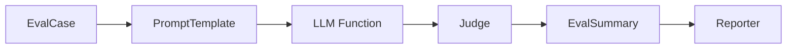

# Architecture

`prompt-eval` thesis: unit tests for prompts with templates, deterministic fixtures, judges, and reports.

## Design Rules

- Keep the public API small enough to inspect in one sitting.
- Make demos run locally without network credentials.
- Put correctness checks in tests, conformance scripts, or benchmark scripts
  instead of relying on README claims.
- Prefer explicit failure modes over surprising implicit behavior.
